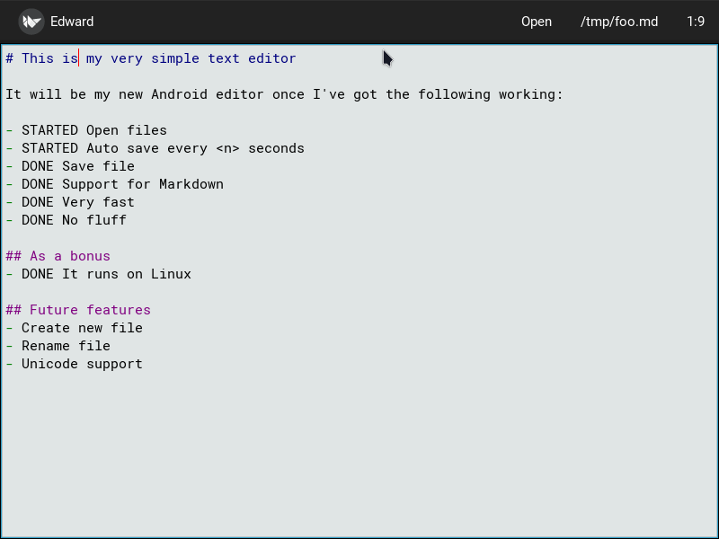

# Edward 

Lean and fast Markdown editor for Android and Linux.

The primary aim is to make a fast editor for Android that's exactly
the way I like it to be. Since it's written in Python, it's cross
platform by nature and will run on Linux too. However, if there's ever
a conflict between the two, Android will take precedence.



## Why?
Does the world need another editor? Definitely not. What I _do_
believe, though, is that _I_ need another editor for Android. I've
tried a dusin and can't be bothered anymore. They're all either too
slow to open for quick edits, are too bloated or don't store the files
in plain text. And if they do, they don't have Markdown syntax
highlighting.

What I want is what I've listed under the "Minimum lovable product"
below.

## Features

### Minimum Lovable Product aka MVP
- ✅ Large text area.
- ✅ Load fast
- ✅ Read file from disk
- ✅ Save
- ✅ Auto save every `<n>` seconds
- ✅ Undo
- ✅ Markdown support
- ✅ Open file
- 🆕 Save as
- 🆕 Run on Android
- 🆕 Easy to use with standard Android keyboards like Gboard.

### Bonus features
- ✅ Runs on Linux
- ✅ Open file from the command line with `edward.py <file>`

### Future features
- 🆕 Full Unicode support
- 🆕 Emacs shortcuts on Linux
- 🆕 Search for text
- 🆕 Configurable with `~/.edward.conf`

### Will not do
- Version control
- File upload, be that FTP, SSH/SCP, rsync
  

## Install

First, you need to have `pipenv` and `make` installed. On Arch Linux
you can install these with:

```text
# pacman -S core/make
# pacman -S extra/python-pipenv
```

Then, get the source code and install the dependencies in a virtual
environment:
```text
$ git clone https://github.com/skybert/edward.git
$ cd edward
$ make install
```

Finally, run Edward with:
```text
$ make run
```

## License
See the [LICENSE](LICENSE) file.
